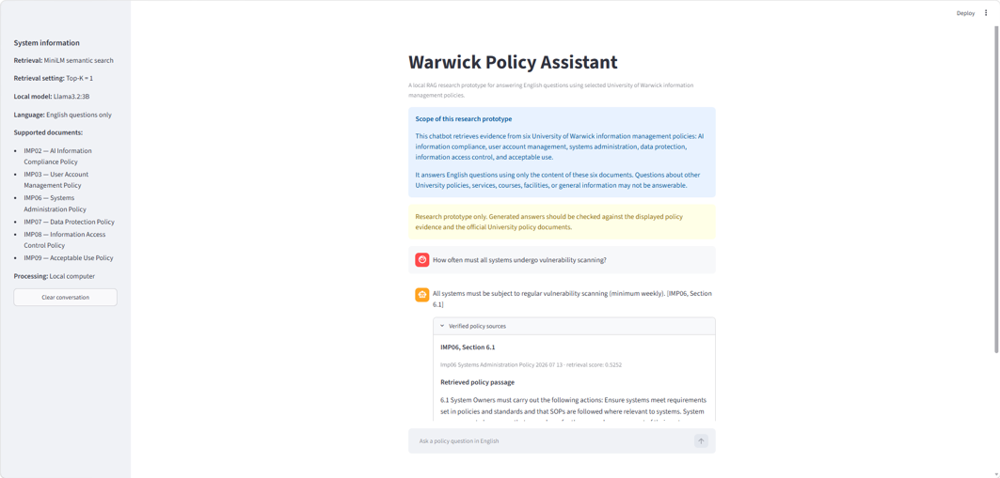

# Warwick Policy Assistant

Public release of a local retrieval-augmented generation (RAG) prototype developed for an MSc Applied Artificial Intelligence dissertation at the University of Warwick.

The system answers English questions using evidence retrieved from six public University of Warwick information-management policies. It combines MiniLM semantic retrieval with the local `llama3.2:3b` model served by Ollama.

> Research prototype only. Generated answers should be checked against the displayed evidence and the official University policy documents.

## Online demonstration

**Test URL:** [http://57.128.179.57:8501](http://57.128.179.57:8501)

Planned availability: **until 26 September 2026**.

If the hosted demonstration is unavailable, this repository contains the application code and the complete semantic index required to run the prototype locally.



## Included system

- English-only Streamlit chat interface.
- Policy-aware document chunks.
- MiniLM semantic retrieval using `sentence-transformers/all-MiniLM-L6-v2`.
- Top-1 evidence retrieval for the deployed interface.
- Local answer generation with Ollama and `llama3.2:3b`.
- Evidence citations and retrieved policy passages.
- Evidence-based refusal when the six policies do not support an answer.
- A frozen semantic index containing **268 chunks from 6 documents**.
- Automated unit tests and dissertation evaluation materials.

## Supported policies

| ID | Policy | Official source |
|---|---|---|
| IMP02 | Artificial Intelligence Information Compliance Policy | [University of Warwick](https://warwick.ac.uk/services/secretarytocouncil/info-security/im-policy-framework/policies/imp02/) |
| IMP03 | User Account Management Policy | [University of Warwick](https://warwick.ac.uk/services/secretarytocouncil/info-security/im-policy-framework/policies/imp03/) |
| IMP06 | Systems Administration Policy | [University of Warwick](https://warwick.ac.uk/services/secretarytocouncil/info-security/im-policy-framework/policies/imp06/) |
| IMP07 | Data Protection Policy | [University of Warwick](https://warwick.ac.uk/services/secretarytocouncil/info-security/im-policy-framework/policies/imp07/) |
| IMP08 | Information Access Control Policy | [University of Warwick](https://warwick.ac.uk/services/secretarytocouncil/info-security/im-policy-framework/policies/imp08/) |
| IMP09 | Acceptable Use Policy | [University of Warwick](https://warwick.ac.uk/services/secretarytocouncil/info-security/im-policy-framework/policies/imp09/) |

The original downloaded HTML files are not published because saved webpages can contain account/session metadata. The runtime does not require them because the processed chunks and embeddings are included. See [the release data note](docs/release_data_note.md).

## System requirements

- 64-bit Windows or Linux
- At least 8 GB RAM
- At least 10 GB of available disk space
- Internet access during the initial setup
- Approximately 15–30 minutes for the first installation and model downloads

No GPU is required. The prototype runs on CPU.

## Quick start on Windows

### 1. Install prerequisites

Install:

- [Git for Windows](https://git-scm.com/download/win)
- [Python 3.11](https://www.python.org/downloads/)
- [Ollama for Windows](https://ollama.com/download)

### 2. Download and prepare the project

```powershell
git clone https://github.com/SunBaodiyu/warwick-policy-rag-chatbot-release.git
cd warwick-policy-rag-chatbot-release

py -3.11 -m venv .venv
Set-ExecutionPolicy -Scope Process -ExecutionPolicy Bypass
.\.venv\Scripts\Activate.ps1

python -m pip install --upgrade pip
pip install -r requirements.txt
```

### 3. Download the embedding and generation models

The first command downloads MiniLM into the local Hugging Face cache. This is required because the application deliberately loads the embedding model from the local cache during use.

```powershell
python -c "from sentence_transformers import SentenceTransformer; SentenceTransformer('sentence-transformers/all-MiniLM-L6-v2')"
ollama pull llama3.2:3b
ollama run llama3.2:3b "Reply with exactly: MODEL_OK"
```

The final command should print:

```text
MODEL_OK
```

### 4. Run the application

```powershell
streamlit run app.py
```

Open [http://localhost:8501](http://localhost:8501) if the browser does not open automatically.

## Quick start on Ubuntu/Linux

```bash
sudo apt update
sudo apt install -y git python3-venv

git clone https://github.com/SunBaodiyu/warwick-policy-rag-chatbot-release.git
cd warwick-policy-rag-chatbot-release

python3 -m venv .venv
source .venv/bin/activate
python -m pip install --upgrade pip
pip install -r requirements.txt

python -c "from sentence_transformers import SentenceTransformer; SentenceTransformer('sentence-transformers/all-MiniLM-L6-v2')"

curl -fsSL https://ollama.com/install.sh | sh
ollama pull llama3.2:3b
ollama run llama3.2:3b "Reply with exactly: MODEL_OK"

streamlit run app.py
```

If Ollama is installed but not running as a service, run `ollama serve` in a separate terminal before starting Streamlit.

## Verification

Test the complete RAG pipeline:

```powershell
python -c "from policy_rag.rag import answer_question; r=answer_question('How often must systems undergo vulnerability scanning?'); print(r['status']); print(r['answer'])"
```

A supported response should state that systems are scanned at least weekly and cite IMP06, Section 6.1.

Run the automated tests:

```powershell
python -m unittest discover -s tests -v
```

The frozen release contains 68 unit tests.

## Project structure

```text
.
|-- app.py
|-- artifacts/
|   `-- semantic_index/
|       |-- chunks.json
|       |-- embeddings.npy
|       `-- metadata.json
|-- data/
|   `-- evaluation/
|-- docs/
|-- policy_rag/
|-- scripts/
|-- tests/
|-- requirements.txt
`-- requirements-lock.txt
```

## Reproducibility note

The dissertation's reported results were produced in a frozen Windows experiment environment. The detailed personal-machine snapshot is not published, but the public release preserves the same chunk texts, order, embeddings, metadata, retrieval code, generation code and dependency lock file.

For privacy, only the `source_path` values in the public `chunks.json` were changed from an absolute local Windows path to a repository-relative path. This packaging change does not affect embeddings, retrieval scores or generated answers.

## Troubleshooting

- **MiniLM cannot be found:** repeat the SentenceTransformer download command while connected to the internet.
- **Ollama connection error:** start Ollama and confirm `ollama run llama3.2:3b "Reply with exactly: MODEL_OK"` works.
- **Semantic index missing:** confirm the three files under `artifacts/semantic_index/` were downloaded by Git.
- **Wrong Python version:** create the virtual environment with Python 3.11.
- **Slow first answer:** the first request loads MiniLM and the Ollama model into memory; later requests are normally faster.
